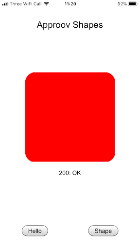
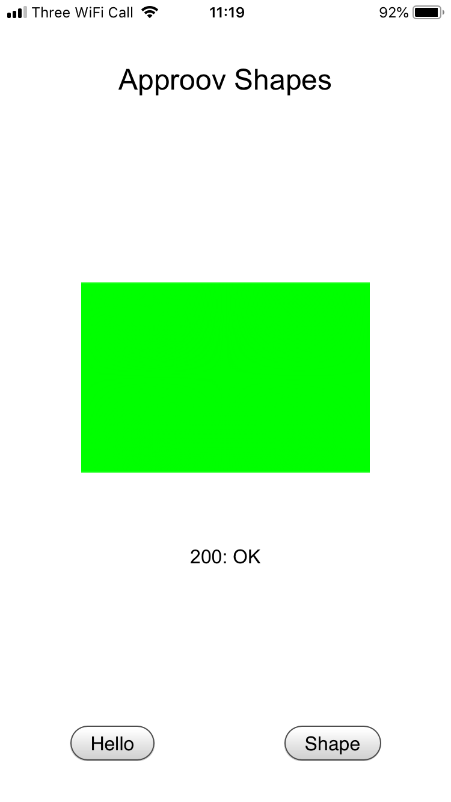

# Approov Quickstart: Flutter HTTP Client

This quickstart is written specifically for Android and iOS apps that are implemented using [`Flutter`](https://flutter.dev/) and the [`Dart HTTPClient class from the dart:io library`](https://api.dart.dev/stable/2.9.3/dart-io/HttpClient-class.html) or the [`Flutter HTTP package`](https://pub.dev/packages/http). If this is not your situation then please check if there is a more relevant Quickstart guide available.

## WHAT YOU WILL NEED
* Access to either the demo account ([request access here](https://info.approov.io/demo-token)) or a trial/paid Approov account
* The `approov` command line tool [installed](https://approov.io/docs/latest/approov-installation/) with `APPROOV_MANAGEMENT_TOKEN` set with your account access token
* The contents of the folder containing this README

## WHAT YOU WILL LEARN
* How to integrate Approov into a real app in a step by step fashion
* How to register your app to get valid tokens from Approov
* A solid understanding of how to integrate Approov into your own app that uses [`Flutter`](https://flutter.dev/) and [`Dart HTTPClient`](https://pub.dev/packages/http) or [`Flutter HTTP`](https://pub.dev/packages/http)
* Some pointers to other Approov features

## RUNNING THE SHAPES APP WITHOUT APPROOV

The Shapes App is a simple Flutter application which demonstrates using the [Client class](https://pub.dev/documentation/http/latest/http/Client-class.html) of the Flutter [http package](https://pub.dev/packages/http) and the [HttpClient class](https://api.dart.dev/stable/2.10.1/dart-io/HttpClient-class.html) of the Dart [IO library](https://api.dart.dev/stable/2.10.1/dart-io/dart-io-library.html) to make HTTP requests.

<p>
    
</p>

The application consists mostly of boilerplate code, apart from the definitions of the shapes server’s URLs and the onPressed callbacks (`hello()` and `shape()`) for the buttons along the bottom of the screen.

The _Hello_ and _Shape_ buttons initiate API requests to the shapes server, using the the Flutter http package's Client. For example, the _Hello_ button initiates a `GET` request to the `shapes.approov.io/v1/hello` endpoint.

On a successful _hello_ request to `/v1/hello`, the client app will say hello with a smile, while a failure or unsuccessful response will return a frown with some explanation of the error. The purpose of this simple endpoint is really just to test connectivity and to verify that you have built, installed and run the demo app correctly.

<a>
    
</a>

<a>
    
</a>

A successful _shapes_ request to `/v1/shapes` returns one of four possible shapes:

<a>
    
</a>

<a>
    
</a>

<a>
    
</a>

<a>
    
</a>

Before building the Flutter Shapes app, make sure that your system is set up for Flutter development by following the instructions at [Flutter Get Started](https://flutter.dev/docs/get-started/install).

### Running the App

To run the app on an attached device, open a shell terminal at the `quickstart-flutter-httpclient/approov_http_client/example` directory and type:

```
$ flutter run
```
For Android: if the Android build fails with `Manifest merger failed : Attribute application@label value=([...]) from AndroidManifest.xml:11:9-46 is also present at [approov-sdk.aar] AndroidManifest.xml:12:9-41 value=(@string/app_name)`, then open `quickstart-flutter-httpclient/approov_http_client/example/android/app/src/main/AndroidManifest.xml` in an editor and make the following changes.

- Add the schema as an attribute in the `manifest` tag:

```
    <manifest ...
        xmlns:tools="http://schemas.android.com/tools"
        ... >
```
- Add the `android:label` and `tools` attributes to the `application` tag:
```
    <application ...
        android:label="@string/app_name"
        tools:replace="label"
        ... >
```

For iOS: if the iOS build or run step fail with a signing error, open the Xcode project located in `
quickstart-flutter-httpclient/approov_http_client/example/ios/Runner.xcworkspace`:
```
$ open ios/Runner.xcworkspace
```

and select your code signing team in the _Signing & Capabilities_ section of the project.

Also ensure you modify the app's `Bundle Identifier` so it contains a unique string (you can simply append your company name). This is to avoid Apple rejecting a duplicate `Bundle Identifier` when code signing is performed. Then return to the shell and repeat the failed build step.

You should now be able to use the app to say hello and get shapes.


## ADDING APPROOV SUPPORT

### Add the Latest Approov SDK

The underlying Approov SDK itself is not shipped as part of the `approov_http_client` module. To get the latest version of the SDK, use the [`approov` command line tool](https://approov.io/docs/latest/approov-installation/). In a terminal shell in your `quickstart-flutter-httpclient/approov_http_client` directory, type:

For Android (if you are using Windows then substitute `approov` with `approov.exe` in all cases in this quickstart):

```
$ approov sdk -getLibrary android/approov-sdk.aar
```
This directly gets the SDK into the correct location in the plugin. On success, the tool outputs a message similar to this:

```
Android SDK library 2.3.0(2726) written to android/approov-sdk.aar
```

For iOS:
```
$ cd ios
$ approov sdk -getLibrary approov.zip
```
On success, the tool outputs a message similar to this:

```
$ iOS SDK library 2.3.0(4359) written to approov.zip
```
Unzip the downloaded archive:
```
$ unzip approov.zip
$ rm approov.zip
$ cd -
```
This will write the Approov SDK framework into `Approov.framework` in the correct location in the plugin.

### Set up an Initial Approov Configuration

An Approov-enabled app requires a [configuration file](https://approov.io/docs/latest/approov-usage-documentation/#sdk-configuration) to initialize it. The Approov configuration is updated dynamically after subsequent launches of the app. In a shell in the `quickstart-flutter-httpclient/approov_http_client/example` directory, use the approov command-line tool to fetch a configuration file:

```
$ approov sdk -getConfig approov-initial.config
```

On success, the tool reports:

```
initial SDK configuration written to approov-initial.config
```

### Add the Approov HTTP Client Flutter Plugin

Approov protection is provided through the approov_http_client plugin for both, Android and iOS mobile platforms. This plugin handles all Approov related functionality, such as initialization, managing of initial and update configurations, fetching of Approov tokens, adding these to API requests as necessary, and manages certificate public key pinning. The plugin also requests all necessary network permissions.

In the configuration file `quickstart-flutter-httpclient/approov_http_client/example/pubspec.yaml` find the two locations marked with
```
# *** UNCOMMENT THE SECTION BELOW FOR APPROOV ***
```
and change them as shown

1. Add the dependency for the approov_http_client package
```
  # *** UNCOMMENT THE SECTION BELOW FOR APPROOV ***
  approov_http_client:
    path: ../
```

2. Add the initial approov configuration to the app's assets
```
    # *** UNCOMMENT THE LINE BELOW FOR APPROOV ***
    - approov-initial.config
```

In the source file `quickstart-flutter-httpclient/approov_http_client/example/lib/main.dart` find the two locations marked with a comment
```
// *** UNCOMMENT THE SECTION BELOW FOR APPROOV ***
```
and change them to read

1. Import the approov_http_client package
```
// *** UNCOMMENT THE LINE BELOW FOR APPROOV ***
import 'package:approov_http_client/approov_http_client.dart';
```

2. Create a Client.
```
// http.Client client = http.Client();
// *** UNCOMMENT THE LINE BELOW FOR APPROOV (and comment out the line above) ***
client = ApproovClient();
```

### Select the Correct Shapes Endpoint

The Shapes server provides the app with shapes using multiple versions of an API: version 1 (https://shapes.approov.io/v1/shapes) which is _not_ protected by Approov, and version 2 (https://shapes.approov.io/v2/shapes) which _is_ protected by Approov.

Now that we’re using Approov, let’s switch to use version 2 of the Shapes API. Edit the Dart source in `quickstart-flutter-httpclient/approov_http_client/example/lib/main.dart` find the line of code:

```
const String API_VERSION = 'v1'; // API v1 is unprotected; API v2 is protected by Approov
```
and change the Shapes server URLs to the v2 API path:
```
const String API_VERSION = 'v2'; // API v1 is unprotected; API v2 is protected by Approov
```

### Ensure the Shapes API is Added

In order for Approov tokens to be generated for `https://shapes.approov.io/v2/shapes` it is necessary to inform Approov about it. If you are using a demo account this is unnecessary as it is already set up. For a trial account do:

```
$ approov api -add shapes.approov.io
```

Tokens for this domain will be automatically signed with the specific secret for this domain, rather than the normal one for your account. After a short delay of no more than 30 seconds the new API settings become active.

### Build and Run the App Again

Build the app on your preferred platform (Approov requires building for a device on iOS).

For iOS: Note that it may be necessary to run the command `pod update` in the `quickstart-flutter-httpclient/approov_http_client/ios` directory first as the Flutter Shapes app is built using the CocoaPods dependency framework.

Run the app on a device or an emulator and examine the logging. You should see in the logs that Approov is successfully fetching tokens, but the Shapes API is not returning valid shapes:

<p>
    
</p>

**Warning:** Never log tokens in a released app as this could permit hackers to harvest data from your API while the token has not expired! Always use _[loggable](https://www.approov.io/docs/latest/approov-usage-documentation/#loggable-tokens)_ Approov tokens for debugging.


## REGISTER YOUR APP WITH APPROOV

Although the application is now receiving and forwarding tokens with your API calls, the tokens are not yet properly signed, because the attestation service does not recognize your application. Once you register the app with the Approov service, untampered apps will attest successfully and begin to fetch and transmit valid tokens.

Approov command line tools are provided for Windows, MacOS, and Linux platforms. Select the proper operating system executable. In a shell in your `quickstart-flutter-httpclient/approov_http_client/example` directory:

For Android:

```
$ approov registration -add build/app/outputs/flutter-apk/app-debug.apk
```

For iOS:

(Assuming you have built an app archive, signed it and exported it to `quickstart-flutter-httpclient/Runner 2020-10-12 09-24-57/Runner.ipa`.)

```
$ approov registration -add ../../Runner\ 2020-10-12\ 09-24-57/Runner.ipa`
```

If you plan to submit your application to the app store, you must remove the Intel CPU simulator support architectures from the Approov SDK binary before submitting your app. To do so, before building the app, execute the following commands at the directory `quickstart-flutter-httpclient/approov_http_client/ios/Approov.framework` using the command line:

```
lipo Approov -remove i386 -output Approov
lipo Approov -remove x86_64 -output Approov
```

Since executing the above commands will disable support for the iOS Simulator, you may wish to keep a copy of the Approov framework or download another copy if a Simulator run is required.


## RUN THE SHAPES APP WITH APPROOV

Wait for the registration to propagate to the Approov service. This can take up to 30 seconds.

Then restart the application on your device to flush out any bad tokens, tap _Shape_ and you should see:

<p>
    
</p>

or any of the four possible shapes returned by the server. Congratulations, your API is now Approoved!


## WHAT IF I DON'T GET SHAPES

If you still don't get a valid shape then there are some things you can try. Remember this may be because the device you are using has some characteristics that cause rejection for the currently set [Security Policy](https://approov.io/docs/latest/approov-usage-documentation/#security-policies) on your Approov account:

* Ensure that the version of the app you are running is exactly the one you registered with Approov.
* If you running the app from a debugger then valid tokens are not issued.
* Approov token data is logged to the console using a secure mechanism - that is, a _loggable_ version of the token is logged, rather than the _actual_ token for debug purposes. This is covered [here](https://www.approov.io/docs/latest/approov-usage-documentation/#loggable-tokens). The code which performs this is:

```
const result = await Approov.fetchApproovToken(url);
console.log("Fetched Approov token: " + result.loggableToken);
```

and the logged token is specified in the variable `result.loggableToken`.

The Approov token format (discussed [here](https://www.approov.io/docs/latest/approov-usage-documentation/#token-format)) includes an `anno` claim which can tell you why a particular Approov token is invalid and your app is not correctly authenticated with the Approov Cloud Service. The various forms of annotations are described [here](https://www.approov.io/docs/latest/approov-usage-documentation/#annotation-results).

If you have a trial (as opposed to demo) account you have some additional options:

* Consider using an [Annotation Policy](https://approov.io/docs/latest/approov-usage-documentation/#annotation-policies) during development to directly see why the device is not being issued with a valid token.
* Use `approov metrics` to see [Live Metrics](https://approov.io/docs/latest/approov-usage-documentation/#live-metrics) of the cause of failure.
* You can use a debugger and get valid Approov tokens on a specific device by [whitelisting](https://approov.io/docs/latest/approov-usage-documentation/#adding-a-device-security-policy).

## USING TOKEN BINDING

It is possible to bind a string of arbitrary data to an Approov token (since Approov tokens can include the hash of an arbitrary data string) which can then be validated by your API.

To bind a data string, call the approov_http_client plugin’s `setDataHashInToken(data)` method.

A common usage for this ‘token binding’ feature is to bind a user’s login token (often an [OAuth2](https://oauth.net/2/) access token), typically specified in the `Authorization` header, to an Approov token thus combining both _user_ authentication and _app_ authentication for an optimal API protection solution. This way only the current authorized user can make API calls from this authenticated app. Example:

```
ApproovService.setBindingHeader('Authorization');
```

In the Shapes v2 API, if the backend service finds a `pay` claim in the Approov token, it looks for an authorization bearer token in the request’s `Authorization` header. If one is found, the backend service will verify that the bearer token’s hash matches the Approov token’s `pay` claim. If the bearer token is not found, the backend service rejects the request.

## NEXT STEPS

This quick start guide has shown you how to integrate Approov with your existing app. Now you might want to explore some other Approov features:

* Managing your app [registrations](https://approov.io/docs/latest/approov-usage-documentation/#managing-registrations)
* Manage the [pins](https://approov.io/docs/latest/approov-usage-documentation/#public-key-pinning-configuration) on the API domains to ensure that no Man-in-the-Middle attacks on your app's communication are possible.
* Update your [Security Policy](https://approov.io/docs/latest/approov-usage-documentation/#security-policies) that determines the conditions under which an app will be given a valid Approov token.
* Learn how to [Manage Devices](https://approov.io/docs/latest/approov-usage-documentation/#managing-devices) that allows you to change the policies on specific devices.
* Understand how to issue and revoke your own [Management Tokens](https://approov.io/docs/latest/approov-usage-documentation/#management-tokens) to control access to your Approov account.
* Use the [Metrics Graphs](https://approov.io/docs/latest/approov-usage-documentation/#metrics-graphs) to see live and accumulated metrics of devices using your account and any reasons for devices being rejected and not being provided with valid Approov tokens. You can also see your billing usage which is based on the total number of unique devices using your account each month.
* Use [Service Monitoring](https://approov.io/docs/latest/approov-usage-documentation/#service-monitoring) emails to receive monthly (or, optionally, daily) summaries of your Approov usage.
* Investigate other advanced features, such as [Offline Security Mode](https://approov.io/docs/latest/approov-usage-documentation/#offline-security-mode), [DeviceCheck Integration](https://approov.io/docs/latest/approov-usage-documentation/#apple-devicecheck-integration) and [Android Automated Launch Detection](https://approov.io/docs/latest/approov-usage-documentation/#android-automated-launch-detection).


