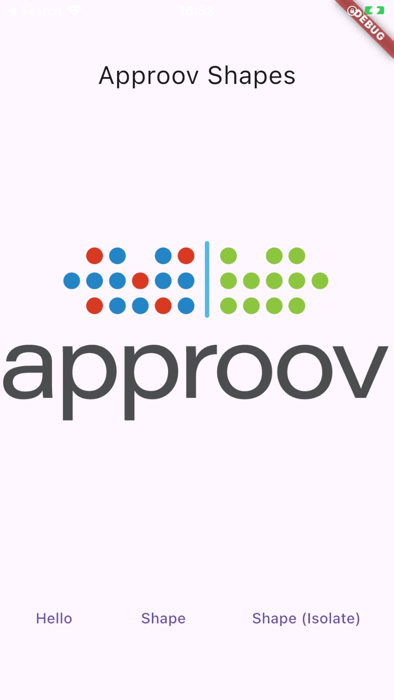
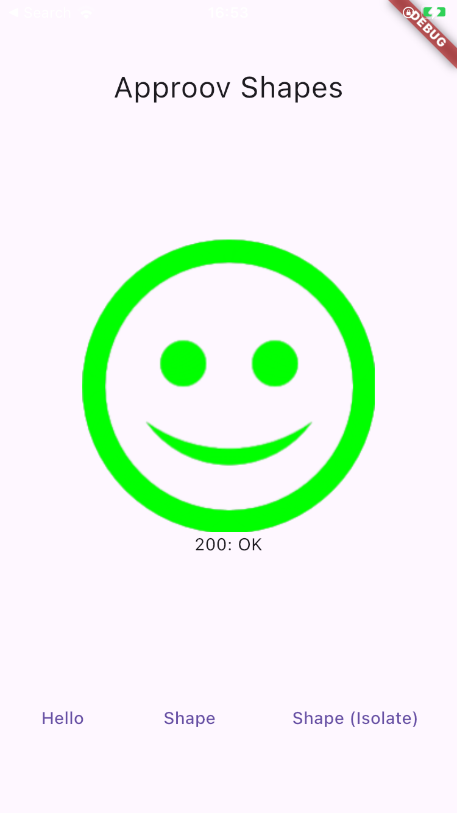
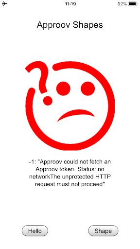
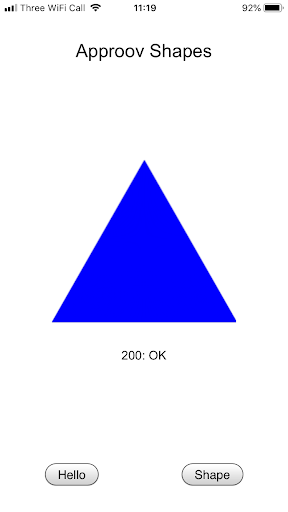
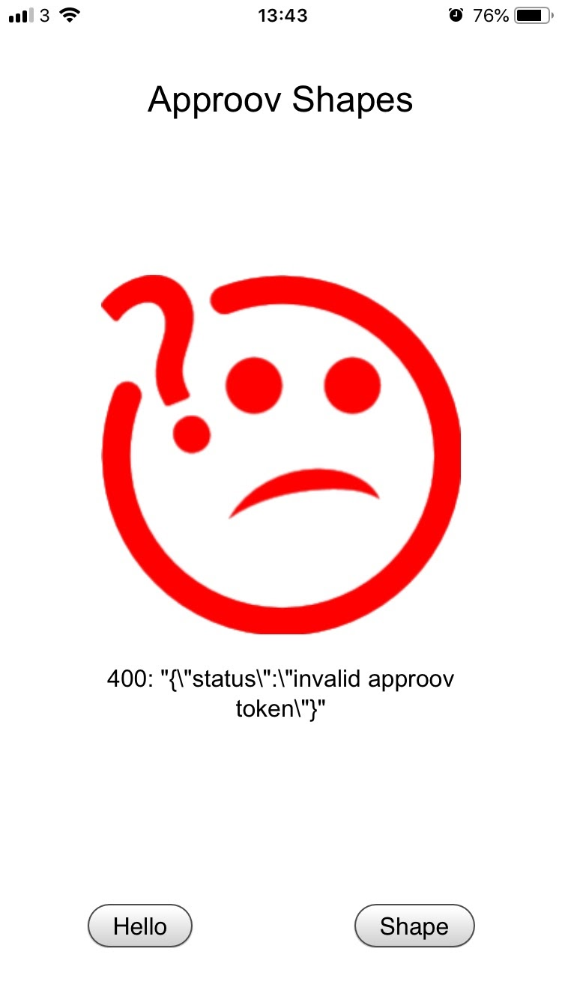
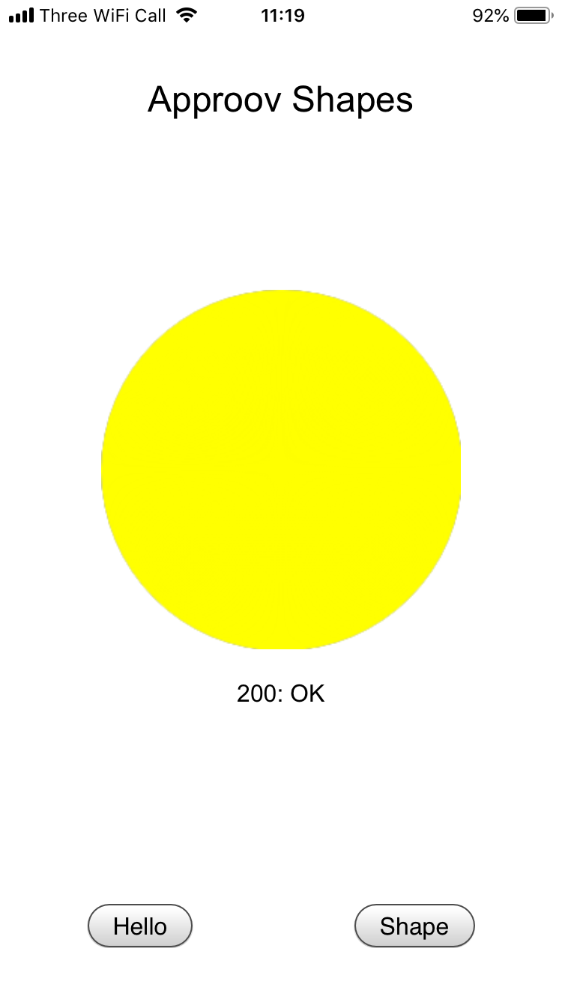

# Shapes Example

This quickstart is written specifically for native Android and iOS apps that are written in [`Flutter`](https://flutter.dev/) and the [`Dart HTTPClient class from the dart:io library`](https://api.dart.dev/stable/2.9.3/dart-io/HttpClient-class.html) or the [`Flutter HTTP package`](https://pub.dev/packages/http) for making the API calls that you wish to protect with Approov. This quickstart provides a step-by-step example of integrating Approov into an app using a simple `Shapes` example that shows a geometric shape based on a request to an API backend that can be protected with Approov.

## WHAT YOU WILL NEED
* Access to a trial or paid Approov account
* The `approov` command line tool [installed](https://approov.io/docs/latest/approov-installation/) with access to your account
* [Android Studio](https://developer.android.com/studio) installed (version Dolphin 2021.3.1 is used in this guide) if you will build the Android app
* [Xcode](https://developer.apple.com/xcode/) installed (version 14.1 is used in this guide) to build iOS version of application
* [Cocoapods](https://cocoapods.org) installed to support iOS building (1.11.3 used in this guide)
* [Flutter](https://flutter.dev) stable version 3.3.7 is used in this guide. Note that integration is not possible with stable versions earlier than Flutter 3.
* The contents of this repo


## RUNNING THE SHAPES APP WITHOUT APPROOV

The Shapes App is a simple Flutter application which demonstrates using the [Client class](https://pub.dev/documentation/http/latest/http/Client-class.html) of the Flutter [http package](https://pub.dev/packages/http) and the [HttpClient class](https://api.dart.dev/stable/2.10.1/dart-io/HttpClient-class.html) of the Dart [IO library](https://api.dart.dev/stable/2.10.1/dart-io/dart-io-library.html) to make HTTP requests.

Before building the Flutter Shapes app, make sure that your system is set up for Flutter development by following the instructions at [Flutter Get Started](https://flutter.dev/docs/get-started/install).

The application consists mostly of boilerplate code, apart from the definitions of the shapes server’s URLs and the onPressed callbacks (`hello()` and `shape()`) for the buttons along the bottom of the screen.

To run the app on an attached device, open a shell terminal at the `quickstart-flutter-httpclient/example` directory and type:

```
flutter run
```

You should now be able to use the app to say hello and get shapes.

<p>
    
</p>

The _Hello_ and _Shape_ buttons initiate API requests to the shapes server, using the Flutter http package's Client. For example, the _Hello_ button initiates a `GET` request to the `shapes.approov.io/v1/hello` endpoint.

On a successful _hello_ request to `/v1/hello`, the client app will say hello with a smile, while a failure or unsuccessful response will return a frown with some explanation of the error. The purpose of this simple endpoint is really just to test connectivity and to verify that you have built, installed and run the demo app correctly.

<a>
    
</a>

<a>
    
</a>

Tap _Shape_ and you should see this (or a different shape):

<a>
    
</a>

This contacts `https://shapes.approov.io/v1/shapes` to get the name of a random shape. This endpoint is protected with an API key that is built into the code, and therefore can be easily extracted from the app.

The subsequent steps of this guide show you how to provide better protection, either using an Approov Token or by migrating the API key to become an Approov managed secret.

See the following sections if you have a problem with building or running.

### Android Potential Issues
If the Android build fails with `Manifest merger failed : Attribute application@label value=([...]) from AndroidManifest.xml:11:9-46 is also present at [approov-sdk.aar] AndroidManifest.xml:12:9-41 value=(@string/app_name)`, then open `quickstart-flutter-httpclient/example/android/app/src/main/AndroidManifest.xml` in an editor and make the following changes.

- Add the schema as an attribute in the `manifest` tag:

```
    <manifest ...
        xmlns:tools="http://schemas.android.com/tools"
        ... >
```
- Add the `android:label` and `tools` attributes to the `application` tag:
```
    <application ...
        android:label="@string/app_name"
        tools:replace="label"
        ... >
```

### iOS Potential Issues
If the iOS build fails with an error related to `Pods-Runner` then navigate inside `ios` folder using `cd ios` and run `pod install`.

If the iOS build fails with an error complaining about missing `.xcconfig` files, like for example `error: could not find included file Pods/Target Support Files/Pods-Runner/Pods-Runner.debug.xcconfig in search paths` you need to open the xcode workspace file `example/ios/ios/Runner.xcworkspace` and await for Xcode to reindex all the files. Then close the workspace and run the test app again.

If the iOS build fails with a signing error, open the Xcode project located in `quickstart-flutter-httpclient/example/ios/Runner.xcworkspace`:

```
open ios/Runner.xcworkspace
```

and select your code signing team in the _Signing & Capabilities_ section of the project.

Also ensure you modify the app's `Bundle Identifier` so it contains a unique string (you can simply append your company name). This is to avoid Apple rejecting a duplicate `Bundle Identifier` when code signing is performed. Then return to the shell and repeat the failed build step.

## ADDING APPROOV SUPPORT

Approov protection is provided through the `approov_service_flutter_httpclient` plugin for both, Android and iOS mobile platforms. This plugin handles all Approov related functionality, such as downloading and installation of Approov SDK library, initialization, managing of initial and update configurations, fetching of Approov tokens, adding these to API requests as necessary, and manages certificate public key pinning. The plugin also requests all necessary network permissions.

In the configuration file `quickstart-flutter-httpclient/example/pubspec.yaml` find the location marked with
```
# *** UNCOMMENT THE SECTION BELOW FOR APPROOV ***
```
and change them as shown:

1. Add the dependency for the `approov_service_flutter_httpclient` package
```yaml
  # *** UNCOMMENT THE SECTION BELOW FOR APPROOV ***
  approov_service_flutter_httpclient:
    git:
      url: https://github.com/approov/approov-service-flutter-httpclient.git
      ref: 3.1.0
```

In the source file `quickstart-flutter-httpclient/example/lib/main.dart` find the two locations marked with a comment and change them:

1. Import the Approov service:
```Dart
// *** UNCOMMENT THE LINE BELOW FOR APPROOV ***
import 'package:approov_service_flutter_httpclient/approov_service_flutter_httpclient.dart';
```

2. Create a Client:
```Dart
// *** COMMENT THE LINE BELOW FOR APPROOV ***
// http.Client client = http.Client();
// *** UNCOMMENT THE LINE BELOW FOR APPROOV ***
client = ApproovClient('<enter-your-config-string-here>');
```

The `<enter-your-config-string-here>` is a custom string that configures your Approov account access. This will have been provided in your Approov onboarding email.

### Select the Correct Shapes Endpoint

The Shapes server provides the app with shapes using multiple versions of an API. Initially version 1 is used that only checks the API key configured in the app. Version 3 (https://shapes.approov.io/v3/shapes) requires a valid Approov token to be passed in the request as well as the correct API key.

Now that we’re using Approov, let’s switch to use version 3 of the Shapes API. Edit the Dart source in `quickstart-flutter-httpclient/example/lib/main.dart` find the line of code:

```Dart
const String API_VERSION = 'v1';
```
and change the version:

```Dart
const String API_VERSION = 'v3';
```

### Ensure the Shapes API is Added

In order for Approov tokens to be generated for `https://shapes.approov.io/v3/shapes` it is necessary to inform Approov about it:

```
approov api -add shapes.approov.io
```

Tokens for this domain will be automatically signed with the specific secret for this domain, rather than the normal one for your account. After a short delay of about 30 seconds the new API settings become active.


### Build and Run the App Again

Build the app on your preferred platform (Approov requires building for a device on iOS).

For iOS: Note that it may be necessary to run the command `pod update` in the `quickstart-flutter-httpclient/example/ios` directory first as the Flutter Shapes app is built using the CocoaPods dependency framework.

Install and run the app on a device and examine the logging. You should see in the logs that Approov is successfully fetching tokens, but the Shapes API is not returning valid shapes:

<p>
    
</p>

## REGISTER YOUR APP WITH APPROOV

Although the application is now receiving and forwarding tokens with your API calls, the tokens are not yet properly signed, because the attestation service does not recognize your application. Once you register the app with the Approov service, untampered apps will attest successfully and begin to fetch and transmit valid tokens.

In a shell in your `quickstart-flutter-httpclient/example` directory you need to register the app with Approov.

For Android:

```
approov registration -add build/app/outputs/flutter-apk/app-debug.apk
```

For iOS it is necessary to explicitly build an `.ipa` using the command `flutter build ipa`. This will provide the path of the `.ipa` that you can then register, e.g:

```
approov registration -add build/ios/ipa/ApproovHttpClient_example.ipa
```

> **IMPORTANT:** The registration takes about 30 seconds to propagate across the Approov Cloud Infrastructure, therefore don't try to run the app again before this time has elapsed.

## RUN THE SHAPES APP WITH API PROTECTION

Restart the application on your device to ensure a new Approov token is fetched, tap _Shape_ and you should see this (or a different shape)::

<a>
    
</a>

Congratulations, your API is now Approoved!

> **NOTE:** Running the app on an emulator or simulator will not provide valid Approov tokens. You will need to ensure it always passes on your the device (see below).

## WHAT IF I DON'T GET SHAPES

If you still don't get a valid shape then there are some things you can try. Remember this may be because the device you are using has some characteristics that cause rejection for the currently set [Security Policy](https://approov.io/docs/latest/approov-usage-documentation/#security-policies) on your Approov account:

* Ensure that the version of the app you are running is exactly the one you registered with Approov.
* Look at the Flutter logging for the device. Information about any Approov token fetched or an error is output at the debug level and is prefixed `ApproovService: updateRequest`. You can easily check the validity of the [loggable token](https://approov.io/docs/latest/approov-usage-documentation/#loggable-tokens) provided find out any reason for a failure.
* Consider using an [Annotation Policy](https://approov.io/docs/latest/approov-usage-documentation/#annotation-policies) during initial development to directly see why the device is not being issued with a valid token.
* Use `approov metrics` to see [Live Metrics](https://approov.io/docs/latest/approov-usage-documentation/#live-metrics) of the cause of failure.
* You can use a debugger or emulator/simulator and get valid Approov tokens on a specific device by ensuring it [always passes](https://approov.io/docs/latest/approov-usage-documentation/#adding-a-device-security-policy). As a shortcut, when you are first setting up, you can add a [device security policy](https://approov.io/docs/latest/approov-usage-documentation/#adding-a-device-security-policy) using the `latest` shortcut as discussed so that the `device ID` doesn't need to be extracted from the logs or an Approov token.
* Approov token data is logged to the console using a secure mechanism - that is, a _loggable_ version of the token is logged, rather than the _actual_ token for debug purposes. This is covered [here](https://www.approov.io/docs/latest/approov-usage-documentation/#loggable-tokens).

The Approov token format (discussed [here](https://www.approov.io/docs/latest/approov-usage-documentation/#token-format)) includes an `anno` claim which can tell you why a particular Approov token is invalid and your app is not correctly authenticated with the Approov Cloud Service. The various forms of annotations are described [here](https://www.approov.io/docs/latest/approov-usage-documentation/#annotation-results).

## SHAPES APP WITH SECRETS PROTECTION

This section provides an illustration of an alternative option for Approov protection if you are not able to modify the backend to add an Approov Token check. Firstly, revert any previous change to use the version 1 Shapes endpoint that simply checks for an API key:

```Dart
const String API_VERSION = 'v1';
```

The `API_KEY` should also be changed to the following, removing the actual API key out of the code:

```Dart
const API_KEY = "shapes_api_key_placeholder";
```

Next we enable the [Secure Strings](https://approov.io/docs/latest/approov-usage-documentation/#secure-strings) feature:

```
approov secstrings -setEnabled
```

> Note that this command requires an [admin role](https://approov.io/docs/latest/approov-usage-documentation/#account-access-roles).

You must inform Approov that it should map `shapes_api_key_placeholder` to `yXClypapWNHIifHUWmBIyPFAm` (the actual API key) in requests as follows:

```
approov secstrings -addKey shapes_api_key_placeholder -predefinedValue yXClypapWNHIifHUWmBIyPFAm
```

> Note that this command also requires an [admin role](https://approov.io/docs/latest/approov-usage-documentation/#account-access-roles).

Next we need to inform Approov that it needs to substitute the placeholder value for the real API key on the `api-key` header. Only a single line of code needs to be changed as follows:

```Dart
// *** UNCOMMENT THE LINE BELOW FOR APPROOV USING SECRETS PROTECTION ***
ApproovService.addSubstitutionHeader("api-key", null);
```

In a shell in your `quickstart-flutter-httpclient/example` directory you need to register the app with Approov.

For Android:

```
approov registration -add build/app/outputs/flutter-apk/app-debug.apk
```

For iOS it is necessary to explicitly build an `.ipa` using the command `flutter build ipa`. This will provide the path of the `.ipa` that you can then register, e.g:

```
approov registration -add build/ios/ipa/ApproovHttpClient_example.ipa
```

> **IMPORTANT:** The registration takes about 30 seconds to propagate across the Approov Cloud Infrastructure, therefore don't try to run the app again before this time has elapsed.

Run the app again without making any changes to the app and press the `Get Shape` button. You should now see a valid shape. This means that the registered app is able to access the API key, even though it is no longer embedded in the app configuration, and provide it to the shapes request.
